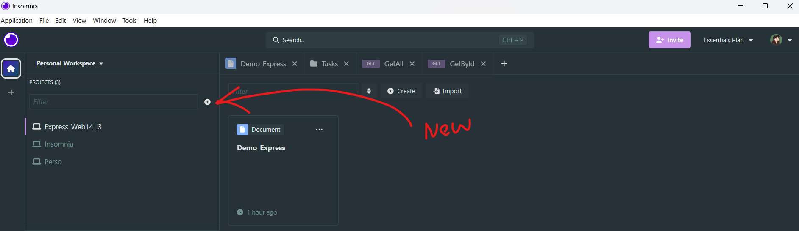
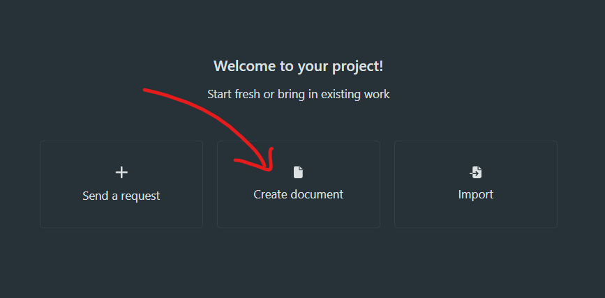
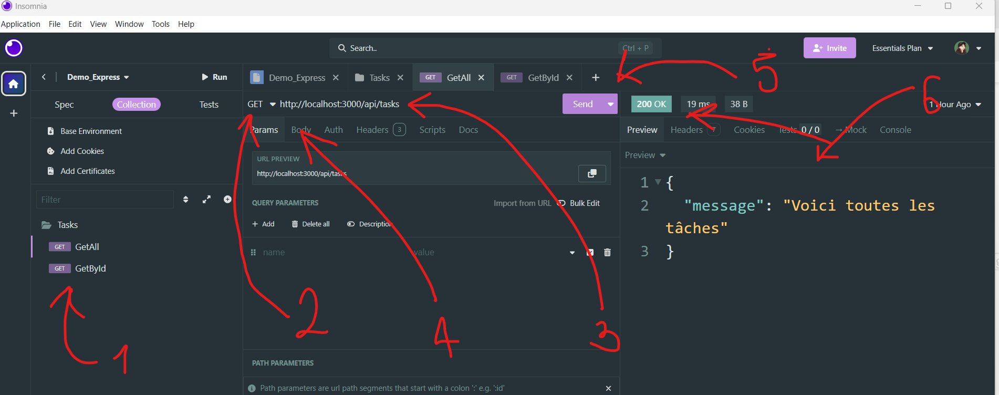
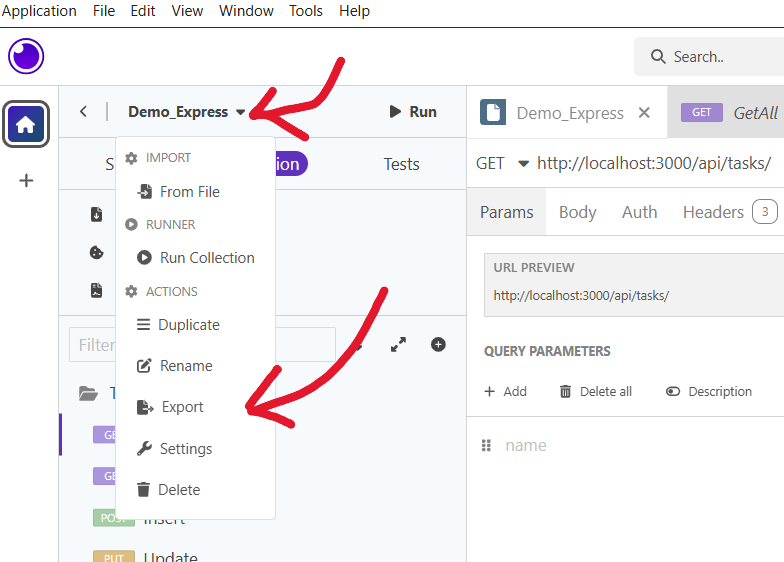
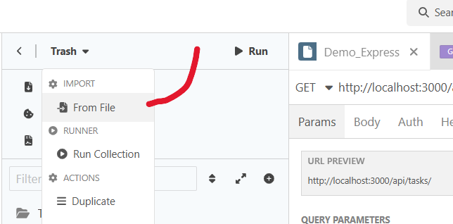
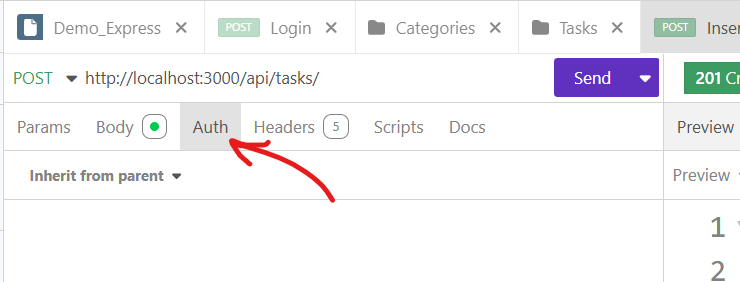
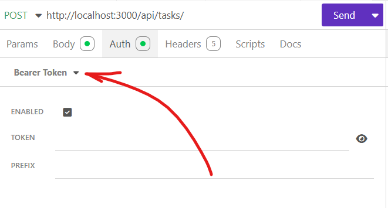
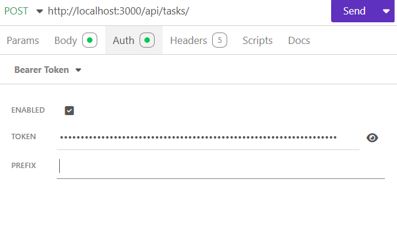

# Web API avec Express
Une Api = un serveur qui va recevoir une **requête** (req), la traiter, potentiellement se "connecter" à des données (entre "" car les API intéragissent avec des données, mais pas forcément des bases de donnéés, même si c'est ça qu'on a fait jusqu'ici) et renvoyer une **réponse** (res) qui possédera au minimm un statut (HttpCode), et potentiellement des données renvoyées (json, ou XML = ancêtre avant le json).
! Voir Schéma dans la documentaion du cours d'Aude !

## Les API

### Fonctionement d'une API
#### Les requêtes
Les raquêtes sont envoyées via le protocole HTTP et pssèdent plusieurs infos qui vont permettre au serveur de comprendre la demande.

Au minimum, il faut

* **Un verbe** (Verb) : Méthodede la requête. Indique au serveur l'ACTION qu'on veut réaliser.
    * **GET** : Récupérer quelque-chose (données, fichiers, images...)
    * **POST** : Envoyer quelque-chose. Peut être utilisé dans plusieurs contextes : envoyer les données d'un utilisateur pour les stocker qlq part et lui créer un compte, utilisateur qui envoie ses données pour se connecter (même si elles ne sont pas stockées, le POST sert juste à envoyer, pas focrément à stocker ce qui est envoyé)...
    * **PUT** : Modification **totale** de quelque-chose : si on modifie quelque-chose dans un objet, c'est tout l'objet qui est renvoyé après modification, comme si tout l'objet avait été modifié. Surtout utilisé pour les gros changements, mais en soi on pourrait l'utiliser pour tous types de changement, c'est juste moins propre si il n'y a que des petits changements à effectuer.
    * **PATCH** : Modification **partielle** : par exemple, si on ne modifie que son avatar sur son compte. Souvent, on utilise PATCH pour les images.
    * **DELETE** : Suppression de quelque-chose.

* **Une URL** : Sur quoi et comment on veut faire notre requête. Elle peut contenir plusieurs éléments :
    * Au minimum, une partie, ou segment statique :     = Le QUOI
    ex: http://localhost:3000/api/produits = il faut au moins ce segment-là si on veut faire des modif ou récupérer qlqch dans les produits.
    * Des paramètres _(optionnel)_ = partie dynamique, car la valeur va pouvoir changer :   = Le QUOI, mais plus précis
    ex : http://localhost:3000/api/produits/42 => Le 42 = partie dynamique, ici l'id d'un produit, qui pourra changer selon le produit qu'on voudra modifier.
    * Une **query** _(optionnel)_ : permet de rajouter des filtres   = Le COMMENT   = tout ce qui vient après le ? dans une url. Quand il y a plusieurs filtres à mettre, on sépare les filtres par un &.
    ex: http://localhost:3000/api/produits?category=bricolage&lowPrice=0&highPrice=15 = ici on demande les produits de la catégoiroe broicolage, entre 0 et 15€.

Ensuite, on peut ajouter :
* Un **body** = corps de la requête : Représente ce qu'on doit envoyer avec la requête (souvent du json, parfois du formData = format d'image, d'où les images qui sont souven traitées différemment du reste), les données qui peuvent être envoyées en même temps que la requête (un nouveau username, une nouvelle photo...). Donc souvent utilisé en POST, PUT ou PATCH.

* Des **headers** = En-tête de la requête : infos sur la requête qu part, on en repârlera plus longuement plus tard.

> [!Note]
> Cerytaines choses seron utilisées avec certains verbes particuliers :
>
> -> GET http://localhost:3000/api/produits\
> Verb + url statique\
> = Récupérer tous les produits
>
> -> GET http://localhost:3000/api/produits/42\
> Verb + url statique  + paramètre
> = Récupérer le produit dont l'id est 42
>
> -> GET http://localhost:3000/api/produits?offset=10&limit=30\
> Verb + url statique + query
> = Récupérer les produits à partir du 10e (offset) et en sélectionnant les 3 prochains (limit) = query de pagination.
> offset et limit : ce qui permet de mettre des limites dans la pagination, ex: je démarre à partir du numéro 10 et je ne veux en voir que 10 par 10.
> Permet aussi de changer la pagination par défaut d'une page si on veut voir plus que ce qui est montré.
>
> -> POST http://localhost:3000/api/produits\
> -> body : {"name" : "Fenouil", "price" = "infini"}\
> Verb + url statique + body\
> = Ajouter un nouveau produit avec les infos présentes dans le body
>
> -> PUT/PATCH http://localhost:3000/api/produits/42\
> -> body : {"name" : "Fenouil la fripouille", "price" = "infini"}\
> Verb + url statique + params + body\
> = Modifier globalement ou partiellement le produit dont l'id est 42.
>
> -> DELETE http://localhost:3000/api/produits/42\
> Verb + url statique + params\
> = Supprimer le produit dont l'id est 42.


#### Les réponses
L'API va toujours renvoyer une réponsequi sera composée de :
* Un **statut** (statusCode, HTTPCode...) : code qui petrmet de savoir comment s'est passé la requête.
    * 2xx (dans les 200) : les codes de succès, selon le numéro ça peut vouloir dire "tout s'est bien passé et voici tes données", "tout s'est bien passé et je n'ai rien à te renvoyer"...
    * 3xx : indiquer une redirection (par exemple si la route d'un site a été changée, on peut voir un message de redirection pendant une certaine période pour préve,nir les utilisateirs que le site n'est plus à la même adresse).
    * 4xx : indiquer qu'une erreur connue de l'API est survenue (on n'a pas envoyé les bonnes infos de connection, ...)
    * 5xx : indiquer une erreur de serveur (serveur ne répond pas, db cassée, accès à la db ne fonctionne pas...) = plutôt des erreurs physiques.
* Des **données** _(optionnel)_ = Certaines requêtes, notammnet en GET, vont nous renvoyer des données (souvent en json), par exemple un objet qu'on aura essayé de récupérer. 

### Principes d'API REST :
Une API REST(Ful) (REpresentation State Transfert) doit respecter le sprincipes suivants :

* **Stateless** (sans état) : Une API ne doit pas garder d'état => ne stockera pas qui est connecté en ce moment, c'est géré à l'extérieur.
L'API ne savuegarde aucune donnée utilisateur. Si besoin d'identifier qui fait la requête, cette info devra être transmise dans la requête, soit dana la query, soit dans les headers, soit dans les cookies 🍪.

* **Interface Uniforme** : = comment l'interface est représentée. L'API doit utiliser des modèles de données uniformes et cohérents (le lastname s'écrit toujours comme ça, pas une fois lastname et une fois lastName), en entrée et en sortie, et utiliser des méthodes, ou Verb, standards (GET, POST...). Conseillé de toujours écrire en anglais.

* **Ressources** : les données sont vues comme des ressources (user, task...) et les url doivent être parlantes/claires.
ex : http://localhost:3000/api/42/tasks = toutes les tâches de l'utilisateur 42.
ex : http://localhost:3000/api/tasks/next = toutes les tâches de tous les utilisateurs, mais seulement les nouvelles pas encore faites.
ex : http://localhost:3000/api/tasks?category=2&category=3. = les tâches qui correspondent aux catégories 2 et 3. Ici, la catégorie n'est pas la ressource recherchée (même si elle est indiquée après tasks), c'est bien la tâche liée à cette catégorie qu'on veut.
=> L'url doit clairement indiquer ce qu'on cherche.

* **Couche & cache** : L'API devrait idéalement être séparée en plusieurs couches logiques (architecture). 
= Partie Couche.
Les requêtes devraient idéalement être mises en Cache (souvent à moitié respecté, et pas obligatoire notamment quand on fait des tests), pour éviter d'interroger l'API pour rien.


## Initialiser un projet Node
### Télécharger Node hihi no shit
http://nodejs.org/fr pour avoir accès à Node et à son gestionnaire de package npm.

### Intialiser un dossier comme étant un projet Node :
```
npm init
```
Tout un tas de questions nous son tposées pour config le projet. Appyuer sur Enter pour valider la valeur par défaut renseignée entre (). Le seul truc à modifier c'est éventiuellement le nom de ficher de point d'entrée (index.js -> app.js).

> Un fichier app.js est alors créé, il contient les commandes pour lancer le projet, les tests... dans un objet appelé **scripts** mais aussi les dépendances du projet qui se trouveront (pas tout de site mais plus tard) dans un objet appelé **dependencies**. Les dépendances sont une liste de librairies js dont notre projet a besoin pour fonctionner.

> [!Warning]
> 📢Attention, il faudra penser à avoir un gitignore en règles à partir de ce moment-là, car les dépendances peuvent peser très lo!urd, donc hors de quetsoin de mettre ça sur git. Soit on le fait à la main (chiant et risqué si on oublie des trucs), soit télécharger un extenson sur VSC "gitignore" qui permet de créer un fichier gitignore en rapport avec un type de projet en particulier. Grâce à cette extension, vous pourrez :
> * appuyer sur f1 ou ctrl + maj + p pour ouvrir la barre des tâches 
> * Sélect Add gitignore
> * Une nouvelle barre de rcehcre apparaît -> commencer à taper Node -> Sélectionner Node dans la liste proposée
> -> 🎆 BIM notre gitignore s'est rajouté tout seul dans notre projet !

### Créer le fichier app.js
Créer un fichier à la racine du projet appelé app.js (ou index;js si on a laissé le nom par défaut).
Rajouter un script pour lancer le fichier app.js :
```json
    "scripts" : {
        "start" : "node app.js"
    }
```


## Installer Express dans le projet :
[Express] (https://expressjs.com/) est juste une librairie JS qui permet de créer des web app et des API plus facilement qu'en NodeJS pur.

Pour l'installer, taper dans la console :
```
npm i express
```
ou

```
npm install express
```

-> Express est maintenant installé dans le projet. Un fichier package-lock.json a été créé(sais po à quoi ça sert), et dans le fichier package.json de base, des dépendances ont été ajoutées, dans lesquelles on voit express !

### Bonus : Récupérer un projet Node/Express :
Quand on va récup un projet Node (Express, React, Angular...), il faudra refaire un node_modules avec toutes les dépendances du projet, en tapant dans la console :
```
npm i
```

### Création d'un serveur Web avec Express :

Nous allons utiliser la librairie Express pour créer notre serveur. Pour ce faire, écrire dans app.js :

```js
const express = require('express'); //import d'express
const server = express(); //création du serveur express

// get sur localhost:3000
server.get('/', (req, res) => {

    res.send({ message : 'C\'est good'}, 200);
})

// get sur localhost:3000/products
server.get('/products', (req, res) => {

    res.send({ message : 'Voici tous les produits'}, 200);
})


// Écouter le serveur sur un port spécifique
server.listen(3000, () => {
    console.log(`🚀 Express Server started on port ${ 3000 }`);
})
```

### Restart du serveur en cas de modification :
Le point chiant de notre serveur actuel, c'est qu'à chaque modif il faut le couper avec **ctrl + c** et le relancer avec npm start.
💡Mais il existe des solutions pour que le serveur se relance tout seul comme un grand à chaque sauvegarde :

### Méthode 1 : Nodemon (long et chiant, c'était pas mieux avant)
Avant, il fallait télécharger une librairie appelée Nodemon.
[Nodemon] est une librairie js qui permet de refresh et restart le server à chaque sauvegarde.
Pour l'installer, il fallait :
```
npm i -D nodemon
```
-D est présent pour l'installe dans les dépendances de dev uniquement.

Il fallait ensuite rajouter le fichier package.json un nouveau script :
```json
    "scripts" : {
        "start" : "node app.js",
        "dev" : "nodemon app.js"
    }
```

#### Méthode 2 : Watch natif de Node depuis la version 18+
Il suffit de rajouter un nouveau script dans package.json :
```json
    "scripts" : {
        "start" : "node app.js",
        "dev" : "node --watch app.js"
    }
```
Pour lancer le serveur en mode dev, il faudra taper cette fois dans la console :
```
npm run dev
```

### Les variables d'environnement :
Ce sont des variables stockées sur notre machine. On y stocke des onfos de connection, ou propres à la mahcine...
On évite de les partager.

elles sont accessibles en JS dans un objet process via sa propriété process.env :
```js
console.log(process.env);
```
Pour créer de nouvelles variables d'environnement, on crée un fichier appelé .env dans lequel on va mettre nos variables d'environnement. Ces infos étant très osuvent confidentielles, ce type de fichier est ignoré par notre .gitignore (on voit qu'il est grisé sur VSC).\
Comme il ne sera jamais mis sur Git, pour que les autres personnes sachent quelles veriables mettre en place chez eux et avec quel nom (mais sans les valeurs associées), on fait souvent un fichier **.env.example**, qui lui n'est pas grisé, donc pas ignoré.

Mais pour le moment, la variable d'environnement PORT=3000 n'est toujours pas dans la machine, on l'a juste écrit.
Pour mettr eles variables d'environnement présentes dans le fichier .env dans les variables de la machine, deux solutions :
* 🦕Version dinosaure : Via la librairie [dotenv]
* 🕺Version jeune et cool : Via une nouvelle fonctionnalité native de Node, donc directement dans nos scripts dans le package.json :
```json
    "scripts": {
        "start": "node --env-file=.env app.js",
        "dev" : "node --watch --env-file=.env app.js",
    }, // Donc ajouter --env-file=.env au milieu du reste.
```


### Architecture du projet :

Les requêtes arrivent dans l'application (_app.js_) et sont dispatchés vers les fichiers de routes (_dossier routes_). En fonction de l'url, du verbe et des potentiels paramètres de routes, on déclenchera la bonne fonction du controller de la ressource  (_dossier controllers_). Ces controllers se chargent de la logique API, ils vont appeler des services (_dossier services_) qui eux se chargent d'intéragir avec les données. Le controlleur va ensuite, en fonction du résultat obtenu, répondre avec le bon code à la requête.

\> demo_express\
|- 📁 controllers\
|- 📁 middlewares\
|- 📁 routes\   
|- 📁 services\
|- app.js\
|- .env\
|- package.json

> 1) 📁 routes : définition d etoutes les routes de notre API (Verb + url statique + params). = toutes les routes que prendra notre API (on aura un fichier pour toutes les routes d'utilisateurs, un pour les routes de blablabla). La request passe d'abord par là, avant de passer au controller.
> 2) 📁 controllers : définition de ce que renvoie l'API. C'est le controler qui renvoie une réponse reçue des services, sans passer par les routes.
> 3) 📁 services  : là où on trouve la logique d'intéraction/ d'accès aux données. Renvoie des services, ou des infos au controller.
> 4) 📁 middleware : petit logiciel, ou fonction, qui intercepte la requête (ou une erreur) afin d'y ajouter/consulter des infos et choisir de continuer la requête, ou de l'arrêter. Sert de police à différents niveaux de la requête pour vérifier qu'on a bien les accès à certaines données 👮‍♂️. Il en existe 3 types :
    router-lvl : middleware de routes, vérifient les accès à certaines routes.
    app-lvl : middlewares d'application, vérifient toutes les requêtes qui passent, sur toutes les requêtes du serveur 
    Tout à la fin du chemin (après les services) :  middleware d'erreur, gère les messages spécifiques à certaines erreurs.

    Voir Morgan : middleware qui fait des trucs apparemment, middleware de log ??

### Définition des routes :
### Point d'entrée :
On commence par créer le point d'entrée de toutes nos routes en créant un fichier **index.js** dans un dossier **routes** : Voir le fichier index.js dans routes.

Dans ce fichier index.js :

```js
const router = require('express').Router();

router.get('/', (req, res) => {
    res.send("Bienvenue sur notre API de gestion de tâches", 200)
});

module.exports = router;
```


Dans le fichier app.js (après création server et avant listen) on va indiquer que notre serveur Express doit utiliser ce routeur :

```js
const router = require("./routes");
server.use('/api', router);
```

#### Ajouter d'autres routes

Pour bien architecturer notre application, on va essayer de gérer les routes de chaque ressource individuellement. Pour cela, on va créer un routeur pour chaque type de ressources et faire le lien entre notre routeur d'entrée (index.js) et nos sous-routeurs.

Pour créer un sous-routeur, on crée un fichier nomRessource.router.js.
_exemple avec task.router.js_ :

```js
const taskRouter = require('express').Router(); //création du sous-routeur task

// en get sur localhost:3000/api/tasks/
taskRouter.get('/', (req, res) => {
    res.send('Voici toutes les tâches', 200)
})

// :id segment dynamique
// en get sur localhost:3000/api/tasks/XX
taskRouter.get('/:id', (req, res) => {
    const id = req.params.id;
    res.send(`Voici la tâche numero ${id}`)
})

// en post sur localhost:3000/api/tasks/
taskRouter.post('/', (req, res) => {
    res.send('Tâche ajoutée avec succès', 200)
})

//export de notre routeur pour pouvoir l'importer depuis un autre fichier
module.exports = taskRouter;
```

Pour donner accès à ce sous-routeur depuis notre fichier principal index.js :

```js
// import du task routeur 
const taskRouter = require('./task.router');

// permet d'indiquer que notre router de base doit utiliser, si l'url est localhost:3000/api/tasks, le task routeur pour la suite
router.use('/tasks', taskRouter)
```

> [!TIP]
> À ce stade, nous ne pouvons tester que nos routes en GET puisque le navigateur ne nous permet que de faire du GET. Pour pouvoir tester tous les verbes, nous aurons besoin de [logiciels de test d'API](#logiciels-test-api).


#### Autre manière d'écrire les routes :

Une autre façon de ranger les routes, quand on a plusieurs fois la même url mais avec différents verbes c'est de partir de l'url et indiquer toutes les méthodes possibles sur cette url.

```js
taskRouter.route('/')
    .get((req, res) => { })
    .post((req, res) => { })

taskRouter.route('/:id')
    .get((req, res) => { })
    .put((req, res) => { })
    .patch((req, res) => { })
    .delete((req, res) => { })
```

### Les controllers :
Les controller ssont les endroits où on va gérer la requêtes (ce qui entre en req et sort en res). C'est ce qui décide d'où vont être envoyées les request et si elles peuvent ressortir en response.
En général, on fait **un controller par type de ressources** -> Ici, on aura un task.controller, un category.controller...
Un controller est un objet qui contient des fonctions à exécuter.
Exemple : _task.controller.js_ :
```js
// Création de notre taskController
const taskController = {

}

// On le rend importable en l'exportant :
module.exports = taskController;
```
Chaque fonction représentera une action (getAll, insert...) qu'on peut faire sur la ressource en question :

_task.controller.js_ :
```js
// Création de notre taskController :
const taskController = {
    //On va créer autant de fonctions qu'il y a de fonctionnalités pour la tâche (getAll, tegById, insert, delete...), en leur donnant pour bien faire le même nom que ce qu'on a créé sur Insomnia :
    getAll : (req, res) => {},

    getbyId : (req, res) => {},

    getbyUser : (req, res) => {},

    insert : (req, res) => {},

    update : (req, res) => {},

    updatedStatus : (req, res) => {},

    delete : (req, res) => {}

}
```
Attention, pour le moment il n'y a pas de code écrit dans les {}, ça va donc momentanément "casser" les requests.

Il ne nous reste plus qu'à relier la route avec sa fonctionnalité **dans le taskRouter** :

_task.router.js_ :
```js
// importer le controleur qu'on vient de créer
const taskController = require('../controllers/task.controller');

// On relie ensuite chaque route à sa fonctionnalité
taskRouter.route('/')
    .get(taskController.getAll)
    .post(taskController.insert)

taskRouter.route('/:id')
    .get(taskController.getById)
    .put(taskController.update)
    .delete(taskController.delete)
    .patch(taskController.updateStatus)

taskRouter.get('/user/:name', taskController.getByUser)

```
Pour que notre request ne soit pas infinie alors que nous n'avons pas encore de code dans notre controller, nous pouvons mettre fin à la request en envoyant un code 501 : _Not implemented_ - qui signifie que la route existe mais que le code derrière n'a pas été implémenté (ou développé) par les dev.

```js
const taskController = {
    getAll : (req, res) => {res.send(501)}
}
```
> [!NOTE]
>Les DTOs :
>Les DTO (Data Object Transfert) sont des représentations d'objets telles qu'elles entrent et sortent de l'API. Parfois à l'insertion l'objet n'est pas identique à celui en DB, donc on aura besoin d'un DTO d'entrée. Parfois, les objets renvoyés par l'API auront aussi besoin d'avoir des données ajoutées ou supprimées, pareil on aura besoin d'un DTO de sortie.

>DONC souvent, nos objet en entrée (req) et en sortie (res) ne possèdent pas les mêmes infos. 
>ex : un objet en entrée (req) ne possédera pas d'id, mais il possédera un password, par contre en sortie il aura un id attribué par l'API, mais pas de password parce que cette info ne doit pas sortir de la BD.

>ex : à la création d'un compte, le paramètre 'isActive' n'est pas là en entrée, mais il est là en sortie après la création du compte.

### Les Services :
C'est l'endroit où on va gérer **la logique d'accès aux données** propre à la recherche / crééaton / suppression des données. Nos contolleurs vont appeler les bonnes méthodes dans les services appropriés.
De nouveau, on fait en général **un service par type de ressource**.

Dans un premier temps, on va travailler avec une **simulation** de DB (fake DB) avec de simples tableaux d'objets JavaScript.

>[!Warning]
>Nos tableaux ne sont pas sauvegardés et seront remis à 0 à chaque lancement du serveur, donc à chaque sauvegarde de modification du code !

>[!Important]
> Plus tard, nous verrons comment [se connecter à une base de données](#connecter-son-api-à-une-db)

>[!Note]
>Certaines données devront être cryptées dans la DB, notamment les mots de passe, pour qu'elles ne soient pas lisibles à l'oeil nu. [Nous le ferons dans les services](#hasher-des-données), car ça doit se faire AVANT l'insertion dans la DB !

1) Création d'un _dossier "services"_, et dedans, d'un fichier _"task.service.js"_. Pour le moment, on va créer un dossier _"fake"_ et un fichier "fakeTask.service.js" et travailler avec ça.
2) Création d'un fichier fakeDB.js, qui représente notre fausse DB.

### Les middlewares :
En français intergiciel, un middleware est une fonction dans laquelle nous avons accès à la request (req), la réponse (res), et une fonction qui permet de continuer le processus de la request.
Un middleware va donc nous permettre d'intercepter n'importe quelle request afin d'y faire des vérifications, des modifs, et de déterminer si la request peut continuer ou pas.

Il existe plusieurs types de middlewares :
* **Built-in** : Les middlewares déjà présents dans express.
(ex : la foncton use() dans app.js)
* **Third-party** : les middlewares qui viennent de librairies externes et qui sont déjà tout faits.
ex : [Multer](https://www.npmjs.com/package/multer), un des plus connus, qui permet de récup les images d'une req, les stocker sur le serveur...
* **Home made** : les middlewares qu'on faits nous-mêmes.

...qu'on peut mettre à 3 endroits différents :
* **Application** (App-lvl Middleware) : middleware qui sera activé sur toute l'app, donc à chaque requête ! Ici, le logMidlleware.
* **Route** (Router-lvl Middleware) : middleware qu'on met seulement sur certaines routes. Ici, le idValidatorMiddleware.
* **Erreur** (Handler-error Middleware) : Doit être mis en avant-dernier, juste avant le lancement du serveur. Permet d'attraper toutes les erreurs qui n'ont pas été gérées par notre API (souvent dans le but d'en faire un fichier de log pour avoir des traces du plantage sans que l'app ne plante pour autant).


## Logiciels test API :
Pour pouvoir tester nos routes API, plusieurs outils :
* [Postman](https://www.postman.com/downloads/)
* [Insomnia](https://insomnia.rest/)
* [Thunder Client](https://www.thunderclient.com/) Extension VSC qui permet de tout faire depuis VSC (Aude ne l'aime pas), permet d'importer son environnement de travail mais pas de l'exporter, donc on ne peut pas "donner" son travail à un autre.

Aude choisit : INSOMNIA ! 🎆🫵👁️

## Télécharger le logiciel
Créer un premier projet (ici, appelé Express)
Créer un document (ici, appelé Demo_Express)

On peut exporter/importer ce doc, avec toutes les requêtes et tous les tests qu'on aura faits. 

Bouton Collection : permet d'ajouter nos requêtes.
Bouton + : New Folder -> l'appeler Tasks.
Petite flèche : HTTP Request -> Créer une nouvelle request.
Tableau de gauche : requete / Tableau de droite: réponse.

Dans dossier Tasks :
On crée une request appelée GetAll = voir toutes les tâches, avec GET http://localhost:3000/api/tasks
Et une request GetById = voir une tâche en particulier, avec GET http://localhost:3000/api/tasks/:id
-> Send -> On voit la réponse dans le tableau de droite !

GET -> pas de Body (pcq on va chercher une info, on n'envoie rien)

En POST :
Envoyer un Body :
Si texte -> En JSON : c'est un objet qu'on envoie -> entre {}.
ex : 
```
{
	"name": "Nettoyer la litière de Fenouil 🌸",
	"category": "Maison",
	"by": "Caroline",
	"for": "Caroline"
}
```
Attention : pour que le JSON puisse être lu par le serveur, ajouter une ligne avant le point 2 de app.js :
```
server.use(express.json());
```
### Créer un nouveau document de test avec Insomnia
Sur la page d'accueil, cliquez ici pour ajouter un nouveau projet :
<div align="center">

</div>

Une fois le projet créé, sur la partie droite, créez un nouveau document :
<div align="center">

</div>

Dans le document, nous allons créer nos requêtes à tester : 
<div align="center">

</div>

* 1 - Liste des requêtes à tester. Idéalement, chaque requête sera dans une dossier représentant la ressource sur laquelle on teste.
* 2 - L'endroit pour changer la méthode et tester en GET, POST, PUT, PATCH, DELETE.
* 3 - L'endroit pour setup l'url de la requête avec les éventuels paramètres
* 4 - L'endroit pour configurer le body (ce qu'on veut envoyer lors d'un POST, PATCH ou PUT par ex)
* 5 - Le bouton pour envoyer la requête
* 6 - L'affichage de la réponse (code en haut et texte, json etc en dessous)

## Exporter un document :
Cliquer sur Demo_Express -> Export -> Sélect les actions à exporter (GET, POST...) -> Export dans un dossier insomnia dans notre projet.

**Exporter** : 
<div align="center">

</div>

Choisissez ensuite les requêtes à exporter puis choisssez Insomnia comme type de document puis validez.

**Importer** :
<div align="center">

</div>

Sélectionnez votre fichier insomnia (ou postman), appuyez sur Scan et tada, votre collection se remplit.

\> [Revenir à la suite du cours Express - Les controlleurs](#les-controlleurs)

<hr>

# Web API avec Mongoose 
## Connecter son API avec une DB
### Mongoose (MongoDB - NoSQL)

Pour connecter notre API à une base de données, nous allons utiliser un ORM (Object-Relational Mapping) ou ODM (Object-Document Mapping). Il s'agit d'un outil (généralement une librairie) où la connection est facilitée et les requêtes aussi. Cet outil nous permettra aussi très facilement de transformer nos objets js en model de donnée et inversement.

### Sequelize (Multi - SQL)
[Sequelize](https://sequelize.org/) est l'ORM le plus utilisé quand on fait du SQL. [TypeOrm](https://typeorm.io/) est son grand frère, prévu si on fait notre API en TypeScript.

### Mongoose (MongoDB - NoSQL)
[Mongoose](https://mongoosejs.com/) est l'ODM prévu pour travailler avec MongoDB.

## Installer Mongoose :
```
npm i mongoose
```
Et bim c'est installé.

### Établir une connection
Dans le fichier app.js :
Installer la connection avant les routes, donc avant le point 2 !!

```js
// On va créer un middleware qui établit une connexion à chaque requête.
// -> Utiliser les app-lvl middlewares :
// Pour établir la connexion, on a besoin d'abord d'importer mongoose :
const mongoose = require('mongoose');
server.use( async(req, res, next) => {
    // À partir de l'objet mongoose importé plus haut, on peut créer une connection :
    mongoose.connect('url')
    // => si on passe la souris sur connect : -> Promise :
    // Vu que la connection peut échouer, la méthode de connexion nous renvoie une promesse
    // => Soit utiliser un try/catch (version bof), soit un Async/await, avec un try/catch (plus propre) :
    try {
        // Essayons de se connecter :
        await mongoose.connect('pouet');
        // + Ajouter un async dans la connexion au serveur plus haut (server.use(async(...))).
        console.log("Successfully connected to the DB !");
        
        next();// Si la req fonctionne, on permet à la requête de continuer sa route.

    } // Et si ça ne marche pas :
    catch(err) {
        console.log(`Connection Failed \n[Reason]\n ${err}`) // les \n = passage à la ligne du message.
        res.status(500).json( {statusCode : 500, message : "Oupsi, impossible de se connecter à la DB 🙂‍↔️ "})
    }
})
```
Ici, avec l'url 'pouet', on reçoit un message d'erreur, car pouet n'est pas correct.


On a besoin, dans la méthode connect, de mettre l'url permettant de se connecter au serveur mongo (notre Cluster)
>[IMPORTANT]
> Par sécurité, on ne met **JAMAIS** notre url dans le fichier app.js, sinon nos données de connexion se retrouvent en free access sur git.
=> On va donc utiliser notre fichier de variables d'environnement, .env !

Dans le fichier .env, on ajoute une DB_CONNEXION :
```js
PORT=3000
DB_CONNEXION=''
```
Ensuite, on retourne sur notre page MongoDB -> Clusters -> Connect -> Choose your application : Drivers -> Copier le long machin qui commence par mongodb+srv -> Le coller dans .env, et remplacer le <password> par notre mot de passe.

Importer cette variable d'environnement en-dessous de celle de PORT :
```js
//? Récupération des variables d'environnement :
const {PORT} = process.env;
    // = J'extraie ce qui m'intérese (ici PORT, le port surlequel on va lancer le serveur) hors de process.env
const {DB_CONNEXION} = process.env;
```

...Et la coller plus bas , à la place de 'pouet' :
```js
// Essayons de nous connecter :
        await mongoose.connect(DB_CONNEXION, { dbName : 'TaskManager' });
```

### Créer les modèles de données de notre DB :
On va créer un dossier appelé Models, dans lequel on crée un fichier truc.model.js pour chaque ressource de notre DB (task.model, category.model,...). => Permettra d'indiquer ce qui est attendu dans notre DB (à quoi ressemble une task, un user...), grâce à des _Schema_ :

Pour créer un model, on créé un fichier _nomRessource.model.js_ :
```js
const { Schema, model } = require('mongoose');

// On créé un schema qui va décrire à quoi ressemble une categorie
// Schema( { description objet }, { options collection } )
const nomRessourceSchema = new Schema({}, {});

// On va créer un model à partir de ce schema
// Le premier paramètre et le nom du model, le deuxième, le schéma de ce model
const NomRessource = model('NomRessource', nomRessourceSchema);

// On exporet le model créé
module.exports = NomRessource;
```


Dans le schema :

* dans le premier objet, on dessine à quoi ressemble la ressource
```js

{
    nomAttribut1 : {
        type : String,
        required : true, /*obligatoire */
        unique : true, /*unique */
        trim : true /* pour enlever les espaces inutiles s'il y en a */
    },
    nomAttribut2 : {
        type : Boolean,
        required : true,
    },
    /* ... */
}
```

* dans le deuxième objet, on fourni les informations sur la collection
```js
{ 
    /* Nom de la collection dans Mongo */
    collection : 'NomCollection',
    /* Pour rajouter la date de création et dernière modif de la ressource */
    timestamp : true,
    /* ... */
}
```

_Exemple avec category.model.js_ :
```js
const { Schema } = require('mongoose'); // Importer Mongoose pour créer des Schemas.

// Créer un nouveau schema pour décrire à quoi ressemble une category :
const categorySchema = new Schema(/**/); // -> sert à décrire le schema

// Créer un model à partir de ce schema :
    // Premier paramètre : le nom du model  (ici, Category)
    // Deuxième paramètre : le schéma de ce model (ici, categorySchema)
const Category = model('Category', categorySchema);

// Ensuite on exporte le model :
module.exports = Category;
```
Ensuite, on remplit new Schema() avec deux objets :
1. Les différents objets qui composent Category (name, icon)
2. Ainsi que les options de collection () : infos sur la colllection
```js
// Créer un nouveau schema pour décrire à quoi ressemble une category :
const categorySchema = new Schema(
    { // 1. Description de ce qui compose la collection :
    name : {
        type : String,
        required : true, // obligatoire
        unique : true, // pas deux fois le même nom
        trim : true, // gère les espace inutiles s'il y en a
    },
    icon : {
        type : String,
        required : true,
        unique : true,
    }
},  { // 2. Options de collection :
    collection : 'Category',// Mettre le nom de la collection avec laquelle on drvra intéragir en DB
    timestamps : true
    // Pour ajouter 2 champs automatiquement :
    // createAt : date -> date de création de la catégorie
    // updateAt : date -> date de dernière modification
}

); // -> sert à décrire le schema
```
Voir le task.model et le user.model pour les petites subtilités de ces fichiers.

Maintenant qu'on a créé une vraie DB avec Mongoose et nos models, on veut importer de VRAIS services dans nos **controllers** =>
- créer les fichiers vraiService dans le dossier services -> mongo,
- remplacer tous les fakeTaskService par des taskService et importer les taskService,
- et ajouter des Async/await et des Try/catch :

_Exemple avec le find de category.service.js :_
```js
find : async() => {
        try {
            // On va interroger la DB de Mongoose (ça peut prendre du temps ou planter donc c'est une promesse => await)
            const categories = await Category.find();
            return categories;
        } catch(err) {
            console.log(err);
            throw new Error(err);
    }
    } //* -> Quand c'est fait, importer ce categoryService dans le categoryController, et faire le reste.
```

_Et ensuite, dans le category.controller.js :_
```js
    getAll : async(req, res) => {
        try {
            // On appelle notre service qui va chercher dans la DB :
             const categories = await categoryService.find();
            // Si ça marche, on envoie les catégories :
            res.status(200).json(categories);
        } 
        catch(err) {
            console.log(err);
            res.status(500).json( { statusCode : 500, message : 'Erreur avec la DB' } );
        }
    },
```
Voir le reste du category.controller pour les petites subtilités des autres ressources (getById, insert, update...)

**Attention** : dans la vraie DB de Mongoose, les id ne sont plus des nombres mais des chaines de caractères ! Donc :
- Aller dans les routers et retirer tous les idValidator(), qui vérifiaient si l'id était bien un chiffre. Faire pareil avec nameValidator().
- Retirer tous les + devant les req, qui transformaient automatiquement les id en nombre.
- à la création de nouveaux objets, utiliser ces id bizarres entre "".

**Remarque** : Maintenant, quand on voudra créer de nouvelles tâches, catégories ou users dans Insomnia, il faudra suivre le même schéma que dans nos models et utiliser les mêmes noms de propriété (name, categoryId, fromUserId...).


### Utiliser ces modèles dans nos services :
Maintenant que les modèles sont faits, nous avons accès à plusieurs méthodes pour effectuer des actions dans la DB :
```js

nomModel.find(); /* permet de trouver tous les éléments correspondant au model */

nomModel.find( { /*ici, filtre*/ } ); /* permet de trouver tous les éléments correspondant au filtre */

nomModel.findById(id); /* permet de trouver l'élément dont l'id est celui renseigné */

nomModel.findByOne( { /* ici, filtre */ } ); /* permet de trouver le premier élément dont qui correspond à notre filtre */

const ressourceCree = nomModel(valeursAAjouter); /* Créé un objet en respectant le schéma du model */
ressourceCree.save(); /* Sauvegarde cet objet en db */

nomModel.deleteOne({ /* filtre */ });// Supprime le premier élément qui correspond au filtre et renvoie un objet avec une propriété deletedCount qui contient le nombre d'élément supprimés

nomModel.findByIdAndDelete(id); //Trouve l'élément grâce à l'id et le supprime. Renvoie l'élément trouvé ou null si pas trouvé

nomModel.deleteMany({ /* filtre */ });//Supprime tous les élements qui correspondent au filtre et renvoie un objet avec la prop deletedCount.
```

## Hasher des données
Nous allons voir comment hasher des données avec l'ajout d'un hash sur le mot de passe des utilisateurs.
Pour gérer les utilisateurs, on crée souvent la partie création de compte et connexion dans une partie nommée "Auth". Nous allons  donc créer une route Auth, un authController et un authService.

Pour hasher, nous avons besoin d'une libreirie de hashage. Nous allons utiliser [Argon2]https://www.npmjs.com/package//argon2, mais il existe aussi Bicrypt et d'autres.

### Installer Argon2 :
Dans le terminal du projet :
```
npm i argon2
```
### Hasher le pssword :
Dans le service, avant l'ajout de l'utilisateur dans la DB, on va faire :
```js
  const hashedPassword = await argon2.hash(user.password);
```

### Vérification du password :
Pour vérifier si un mot de passe correspond à la version hashée :
```js
   const checkPassword = await argon2.verify(hashedPassword, loginPassword);
   // si les deux ne correspondent pas, checkPassword sera faux

```

## Rajouter l'authentification avec JWT
[JWT - Json Web Token](https://en.wikipedia.org/wiki/JSON_Web_Token) est le moyen le plus connu et utilisé de créer un jeton qui permet d'identifier qui est actuellement en train de faire la requête.
Cela permettra, sur certaines routes, de mettre en place de la sécurité et de permettre l'accès aux (à la) ressource(s) uniquement à certains utilisateurs

### Installer Json Web Token :
Installer la librairie jsonwebtoken :
```
npm i jsonwebtoken
```
### Créer un Token :
Ensuite, on crée un dossier Utils avec un fichier _jwt.utils.js_, où :
1) On crée un token dans generate()
2) On le décode dans decode()

**Token** = "jeton" d'autorisation, qui permet de savoir qui fait une requête et lui donner, ou non, l'autorisation de faire cette requête.
Exemples :
- Pour pouvoir modifier la page insta de Bob, il faut avoir les accès de Bob (email et password).
- Sur Youtube, les shorts qui sont envoyés de manière "alléatoire" sont en fait envoyés sur base de notre token, qui contient nos infos de conexion, qui elles-mêmes sont liées à notre historique et aux trucs qu'on regarde.
- Sur Twitch, si on est modérateur, on a des options et boutons en plus par rapports aux paysans randoms.

Pour créer le Token :
Dans _jwt.utils.js_, avec la librairie jsonwebtoken nous avons accès à une méthode pour créer un token :
```js
    jwt.sign(payload, JWT_SECRET, options, (error, token) => {});

```
Cette méthode, sign(), a plusieurs paramètres :

* **payload**, le 1er paramètre, est un objet contenant les informations qu'on veut stocker dans le token.
* **JWT_SECRET**, le 2ème paramètre, est une variable d'environnement contenant le code secret qui sert à encoder et décoder le token. (⚠️ : Pensez à bien le mettre dans vos variables d'env, il ne doit jamais être divulgué)
* **options**, le 3ème paramètre, est un objet qui contient les paramètres d'encodage du token avec le type d'encodage, la date d'expiration etc
* **Un callback**, le 4ème paramètre, qui est une fonction déclenchée lors de la signature du token. Cette fonction possède 2 paramètres, le premier contient une erreur s'il y en a une, le deuxième contient le token si pas d'erreur.

>REMARQUE :
>Promise VS try/catch :
> - try/catch = Gérer le code synchrone, les erreurs immédiates.
> - Promise = Gérer le code asynchrone, les tâches qui prennent du temps(téléchargement, appel serveur, etc.).
>
> On peut gérer les deux en même temps avec un async/await dans un try/catch :
```js
async function commande() {
  try {
    const pizza = await commandePizza;
    console.log(pizza);
  } catch (error) {
    console.log("Erreur :", error);
  }
}
```

Ensuite, dans _.env_ (et _.env.exemple_), aller stocker nos variables d'environnement 'audience', 'issuer' et 'secret' :

```js
PORT
DB_CONNEXION= "";
JWT_ISSUER = "";
JWT_AUDIENCE = "";
JWT_SECRET = "";
```
Pour le secret, aller sur LatPass et générer un code => le mettre dans .env.
Ce **secret** = code secret qui va servir à signer (ou encoder) et à décoder le jeton.
ATTENTION : ce code ne doit JAMAIS finir ur Git !!

Ensuie, on importe le jwtUtils dans la fonction login du _auth.controller.js_ :
```js
else {
                // On va lui générer un token :
               const token = await jwtUtils.generate(userFound);

                // On renvoie quelques infos de l'utilisateur  le token :
                res.status(200).json({
                    id : userFound._id,
                    firstname : userFound.firstname,
                    lastname : userFound.lastname,
                    token : token// ou juste token
                })
            }
```


### Envoyer le token avec la requete :
Un token, ou jeton, s'envoie en l'ajoutant dans les **headers** de la requête (sur Insomnia). Quand on sera en React, on ajoutera nous-même aux headers de la request ce fameux jeton qu'on aura stocké au préalable dans le navigateur.
Sur Insomnia, il y a un bouton tout prêt qui permet d'ajout le token dans les headers de la requête.

Sur Insomnia, copier le token d'un user. Depuis Tasks/insert, aller sur Auth -> Inherit from parent : Bearer Token (car jwt est un Bearer Token).
-> À côté de Token, coller le token.
Le header dans lequel on aura ajouté ce token s'appelle "Authorization".

Cliquer sur le bouton Auth :
<div align="center">

</div>

Sélectionner Bearer Token dans la liste :
<div align="center">

</div>

On copie son token :
<div align="center">

</div>

### Création de middlewares pour récup le token :
On va créer un middleware pour chaque vérification qu'on veut faire, dans un sous-dossier 'auth' du dossier 'middlewares' :
Par exemple :
**authentication** : on crée un _authentication.middleware.js_, qui va se charger de vérifier si le token est envoyé, donc si l'utilisateur est bien connécté.
**userAuthorization** : on crée un _userAuthorization.middleware.js_, qui vérifie si dans le token, l'id de l'utilisateur lui permet de faire ce qu'il demande.
**roleAuthorization** : on crée un _roleAuthorization.middleware.js_, qui vérifie si l'utilisateur possède le bon rôle pour effectuer sa requête.

_Ex : Création d'un authenticationMiddleware :_ 
```js
const authenticationMiddleware = () => {
    return (req, res, next) => {
        
    }
}

module.exports = authenticationMiddleware;
```

On va ensuite activer ces différents middlewares sur les routes qui en ont besoin :
_Dans task.router.js :_
```js
// Midleware pour le token :
const authenticationMiddleware = require('../middlewares/authentication.middleware');

taskRouter.route('/')
    .get(taskController.getAll)
    .post(authenticationMiddleware(), bodyValidatorMiddleware() , taskController.insert)

```

### Déchiffrer le token :
Pour décoder un token, on utilise la méthode verify() dans _jwt.utils.js_ :
```js
jwt.verify(token, JWT_SECRET, options, (error, playload) => {
               
                if(error) {
                    reject(error); /* Si erreur, on rejette la promesse*/
                }

                resolve(playload);/* Si pas d'erreur, on résoud la promesse et on renvoie le token*/
            })
```
Comme pour sign(), cette méthode a plusieurs paramètres :

- Le premier, c'est le token à décoder
- Le deuxième, c'est le secret
- Le troisième, ce sont les options
- Le quatrième et dernier, c'est la fonction (callback) qui sera lancée à la fin de la vérification avec comme paramètre erreur et payload


## Gestion des fichiers

Pour envoyer des fichiers dans notre API, il existe plusieurs librairies qui permettent de traiter le fichier reçu et l'ajouter dans un dossier sur le serveur de notre API.
Une de ces librairies s'appelle [Multer](https://www.npmjs.com/package/multer) et vous pourrez trouver une démonstration [en cliquant sur le lien suivant](https://gitlab.com/i3namurfs/demonodemulterfsi3namur).

<hr>

## Validation des données entrantes

Pour vérifier si les données qui arrivent dans notre api via le body ont le format attendu, nous pouvons utiliser une librairie de schémas de validation.
Une des plus connues s'appelle [Yup](https://github.com/jquense/yup).

Voici un [projet](https://gitlab.com/i3namurfs/expressfilrougei3) dans lequel cette validation est présente si vous souhaitez y jeter un oeil.
* dans le dossier **validators**, vous trouverez tous les schémas de validation
* dans le dossier **middlewares**, vous trouverez le body-validation, qui prend en paramètre le schema de validation à valider. Si tout est ok, on continue la requête, sinon, on enverra une 400 Bad Request.
* dans les fichiers de **routes**, vous verrez ce middleware appliqué avec le schéma approprié dans tous les post, put et patch.

<hr>

## Mise en place de Swagger
[Swagger](https://swagger.io/) est une librairie de **documentation** d'API. Elle permet d'avoir une interface graphique qui permet de tester toutes les routes avec des informations sur ce qui est attendu dans le body, en sortie, dans les paramètres, la query ainsi que les codes http possibles en retour.

<div align="center"> 

</div>

Il existe une [librairie js Swagger](https://www.npmjs.com/package/swagger-ui-express) pour l'ajouter dans votre projet API mais attention, sa mise en place est un peu fastidieuse.
<hr>

## Bonus
### Utilitaires : 

L'extension VSC [TODO+](https://marketplace.visualstudio.com/items?itemName=fabiospampinato.vscode-todo-plus) vous permet de faire des todo list.
Pour gérer les tâches : 
* ALT + ENTER : Créer une tâche
* ALT + D : Done (Marquer comme faite)
* ALT + S : Started (Marquer comme commencée)
* ALT + C : Cancelled (Marquer comme annulée)

### Librairies sympa pour pimper votre API

[http-status-code](https://www.npmjs.com/package/http-status-codes) est une librairie contenant une énumération des status Http pour gérer plus facilement les réponses de l'API.
Une fois que vous l'aurez installé, dans votre code, vous aurez l'auto-complétion qui proposera les codes possibles avec un nom plus clair que juste un nombre.\
_ex :_
```js
res.status(StatusCodes.OK).json(/* Ce que vous renvoyez */)
```

    